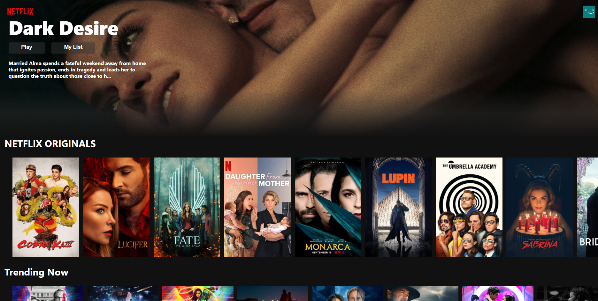

## Netflix Clone

### About
I made this clone as a part of a youtube tutorial I followed which uses React.js, Redux, Firebase, and Stripe payment integration. The link to the tutorial is [here](https://www.youtube.com/watch?v=1TCw9wO1neA)  
I'll soon talk about this clone more on my website [here](http://brysonoar.com/).

### Built With
* React.js
* Redux Toolkit (for global state)
* Firebase (for backend authentication, storage, and hosting)
* Stripe Integration (for payment processing)

### Live Link & Demo

The link is hosted on firebase and can be accessed [here.](https://netflix-clone-ba12f.web.app/)  
The only non-obvious functionality that this page has is that the movie rows are side scrollable.  
